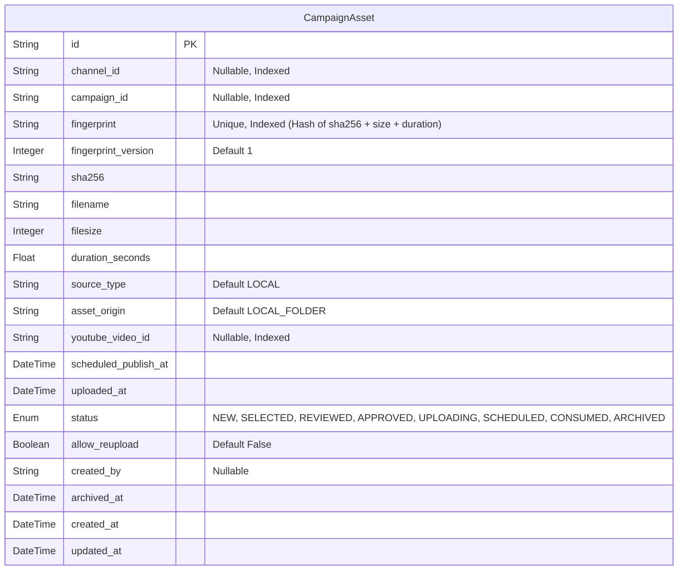

# Campaign Asset Foundation

This document details the backend foundation layer for Campaign Asset Protection implemented in Sprint 1.0.

## 1. Entity Diagram



## 2. Fingerprint Flow

The fingerprint is a unique, immutable identity for any video asset, completely ignoring filename or location.

1. **Calculate SHA-256**: The file is streamed in 64KB chunks to compute the SHA-256 hash. This guarantees constant memory usage regardless of file size (e.g., 500MB vs 4GB).
2. **Read Metadata**: Extracts accurate video `duration_seconds` (float) and `filesize` (integer). If the file is corrupt or metadata is unreadable, it gracefully defaults duration to `0.0`.
3. **Build Fingerprint**: A string format of `{sha256}-{filesize}-{duration_seconds:.3f}` is hashed again using SHA-256. This is the final identity.

## 3. Duplicate Flow (O(1) Validation)

To support analyzing thousands of assets during Campaign folder scans, the system avoids N+1 queries.

1. The scanner calls `load_existing_fingerprints()`, returning a `Set[str]` of all existing fingerprints in the system.
2. The scanner validates newly generated local fingerprints against this Set. Lookup time is `O(1)`.
3. Any fingerprint found in the Set is marked as duplicate.
4. If a duplicate is inserted concurrently, the database `UNIQUE` constraint guarantees consistency. The API returns an HTTP 409 Conflict error.

## 4. API Contract

### POST `/api/v1/campaign-assets/check`
Used to check if an asset exists without inserting.

**Request:**
```json
{
  "sha256": "...",
  "filesize": 123456,
  "duration_seconds": 120.5
}
```

**Response:**
```json
{
  "duplicate": false,
  "fingerprint": "...",
  "status": null,
  "asset": null
}
```

### POST `/api/v1/campaign-assets`
Used to register a new asset into the database. Returns `HTTP 409 Conflict` if the fingerprint already exists.

**Request:**
```json
{
  "sha256": "...",
  "filesize": 123456,
  "duration_seconds": 120.5,
  "filename": "video.mp4",
  "source_type": "LOCAL",
  "asset_origin": "LOCAL_FOLDER"
}
```

### GET `/api/v1/campaign-assets/{fingerprint}`
Retrieves full details of a specific asset.

## 5. Lifecycle (Asset State Enum)

- `NEW`: Asset registered but not yet verified.
- `SELECTED`: Selected for a campaign but pending review.
- `REVIEWED`: Reviewed manually by an operator.
- `APPROVED`: Ready for upload sequence.
- `UPLOADING`: Currently being processed by the upload engine.
- `SCHEDULED`: Uploaded and waiting for a scheduled release time.
- `CONSUMED`: The asset has been successfully published.
- `ARCHIVED`: Soft-deleted or historically retained.

## 6. Future Extension

- **`campaign_id`**: Prepared as a nullable string, ready to become a strict foreign key once the `Campaign` entity is introduced in future sprints.
- **`fingerprint_version`**: Allows backward compatibility. If fingerprint algorithms upgrade (e.g. adding structural video hashing), V1 fingerprints can seamlessly co-exist with V2.
- **`asset_origin`**: Allows campaigns to originate from `GOOGLE_DRIVE`, `DROPBOX`, `S3`, or `YOUTUBE_PLAYLIST` in future architectures.
