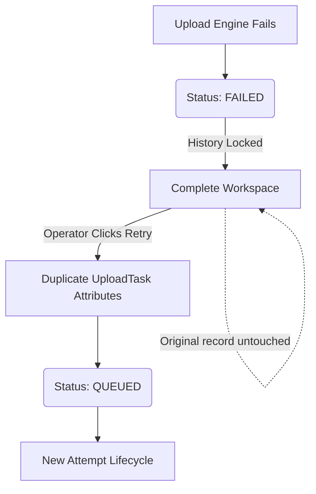

# COMPLETE WORKFLOW (LOCKED)

## Goal
The Complete Workspace is strictly a historical archive (Read-Only). It contains the final states of all tasks processed by the system.

## Core Rules
1. **Immutable History**: Tasks in this workspace cannot have their statuses changed. A `FAILED` task remains `FAILED` forever.
2. **Upload Session Linkage**: Retrying a failed task does **not** mutate the original task. It duplicates the task (Attempt 2) and sends the new duplicate to `QUEUED`. The UI groups these attempts at runtime based on `video_path` and `account_id`.
3. **Runtime Metadata**: Metadata (`Size`, `Duration`, `Resolution`, `Bitrate`) is fetched exclusively at runtime via `VideoMetadataService` (`ffprobe`). It is never saved to the database.
4. **Event-Driven Timeline**: The timeline shown in the Detail Panel is parsed from `UploadLog` entries, ensuring a truthful representation of system events (not just status hops).

## Status Whitelist
1. `SUCCESS`
2. `FAILED`
3. `CANCELLED`

## Retry Flow Diagram

