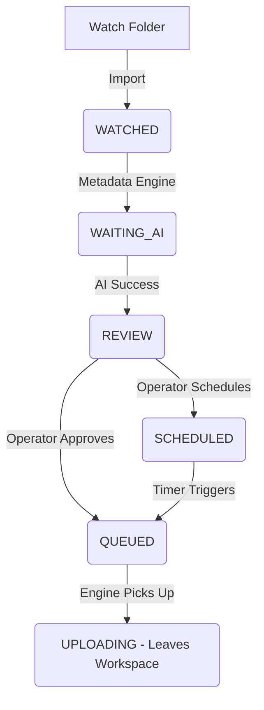

# REVIEW WORKFLOW (LOCKED)

## Goal
The Review Workspace is strictly an active, operational workspace. It only displays tasks that require operator intervention, or are actively scheduled/queued for upload.

## Single Source of Truth
- **Source**: `UploadTask` database model.
- **Synchronization**: Handled exclusively via global `pollingManager`. No duplicate fetching loops allowed.
- **Real-time**: When a task's status transitions outside the whitelist, it instantly vanishes from the UI without requiring a page reload.

## Status Whitelist
The Review Workspace operates on an explicit whitelist. The UI **only** requests tasks in these states:
1. `WATCHED`
2. `REVIEW`
3. `WAITING`
4. `WAITING_AI`
5. `SCHEDULED`
6. `QUEUED`

> [!IMPORTANT]
> The `UPLOADING` state is intentionally **excluded** from this whitelist. As soon as the Upload Engine picks up a `QUEUED` task and sets it to `UPLOADING`, the task vanishes from Review.

## Workflow Diagram

