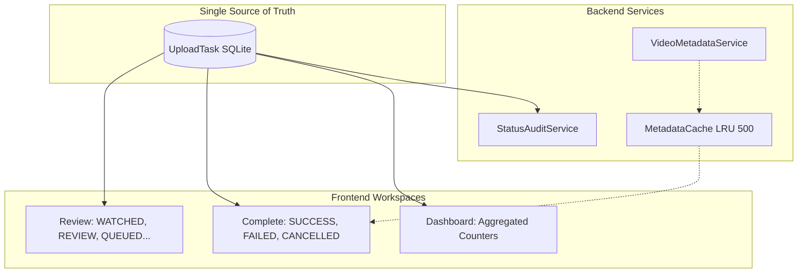

# STATUS LIFECYCLE (LOCKED)

## Goal
To define the permanent, unbreakable Single Source of Truth (SSOT) state machine for `UploadTask`.

## The Rule of Truth
All dashboard counters, workspace tables, analytics, and notification center statuses are derived directly from the exact string value of the `UploadTask.status` column. **No secondary tables or dummy variables are permitted.**

## The Locked Lifecycle
There are only three valid paths a task can take.

### Path 1: The Golden Path (Success)
`WATCHED` ➔ `REVIEW` (or `WAITING_AI` ➔ `WAITING`) ➔ `SCHEDULED` (Optional) ➔ `QUEUED` ➔ `UPLOADING` ➔ `SUCCESS`

### Path 2: The Failure Path
`UPLOADING` ➔ `FAILED`

*(Note: FAILED tasks can spawn new `QUEUED` tasks via the Retry Session feature, but the original FAILED task never changes status again).*

### Path 3: The Cancellation Path
`WATCHED` / `REVIEW` / `QUEUED` ➔ `CANCELLED`

## Status Audit Service
To ensure database integrity, the `StatusAuditService` runs periodically against the formula:
`Total UploadTasks == Sum(Review Whitelist + UPLOADING + Complete Whitelist)`

If an `UploadTask` somehow obtains an illegal status (e.g., `UNKNOWN`, `PROCESSING`), the Audit Service throws a `WARNING UploadTask Status Mismatch` directly to the Dashboard Notification Center.

## Full Ecosystem Diagram

